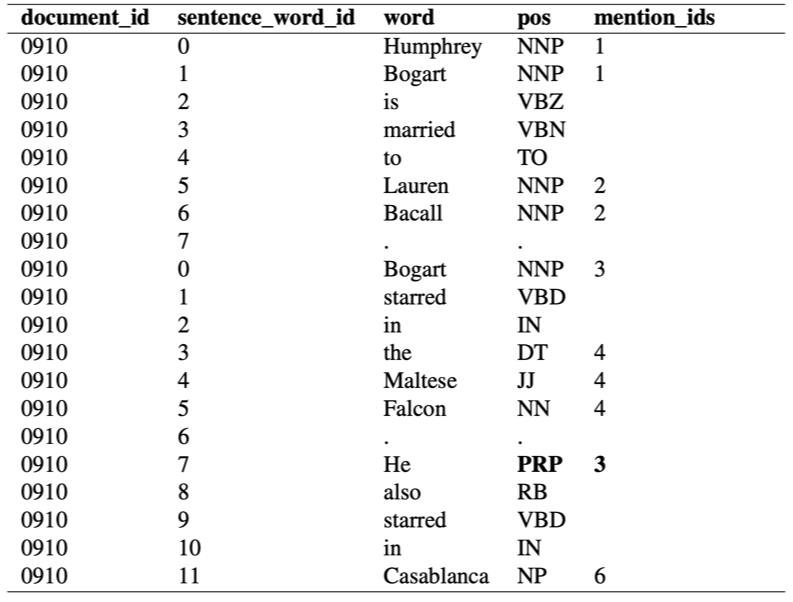
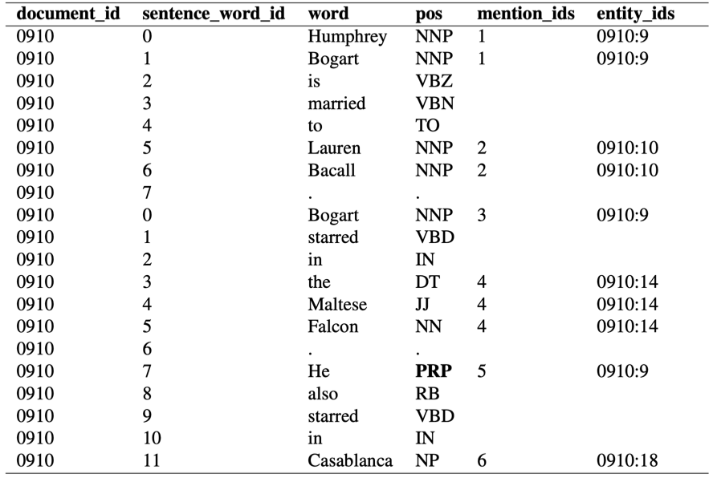

# Antecedent Coreference Resolver

**This script finds the antecedent for each pronoun in a given dataframe input using a Logistic Regression Model.**

## How it works

The script takes in a `.csv` file that is formatted as follows:

<p align="center">
  
</p>

The `.csv` file is converted into a Pandas dataframe before it is passed into the antecedent predictor. Note that the antecedent predictor makes a coreference prediction for each word that has a part of speech tag of `PRP` or `$PRP`. Also, note that the antecedent prediction is a mention id and that each prediction is stored in its `mention_ids` column of each pronoun in the said dataframe. Once all of the pronouns have their predicted antecedents, the dataframe is then converted back to a `.csv` file and outputted. 

### Input formatting
* The input file must be named `test.coref.data.txt` and must have the format mention above.
* The training data file must be named `train.coref.data.txt` and must have the following format:

<p align="center">
  
</p>

* The dev data file must be named `dev.coref.data.txt` and must have the same format as the training data.

> Note that `entity_ids` are the true entity ids from the given data set.

## Sample execution
Note the filenames required for the input (it is mentioned above).

To run the script simply execute `python resolver.py` in the terminal.

You will get the following:
```
Creating LoReg Training Data...
    Length of data: 617565
Creating LoReg Dev Data...
    Length of data: 219867
Featurizing Dev and Training data...
Featuring: 617565/617565 
Adding Feature: 617565/617565 
Featuring: 219867/219867 
Adding Feature: 219867/219867 

Training LoReg, Feature Count: 13525
LoReg Results:
    Train acc: 0.9239124626557529, dev acc: 0.8785765940318465

Evaluating Test File...
Creating LoReg Test Data...
    Length of data: 134494
Featurizing Test data...
Featuring: 134494/134494 
Adding Feature: 134494/134494 
Modding DF: 134494/134494 
Written as: test.coref.data.txt

Modding DF: 219867/219867 
Dev Accuracy (DataFrame Replaced): 0.7050
```

**Note that the output will be saved to your "test" file (i.e: `test.coref.data.txt`)**

## The goal and my result

A naive implementation of just using the closest antecedent would yield a test data accuracy of 53 percent. The goal of this project was to dramatically improve the accuracy of the predictions. 

My implementation had a test accuracy of about 69 percent.

## Implementation Details

A write up documenting my implementation can be found [here](/write-up.pdf)
 
## Credits
This was originally a project that I did for [David Bamman's](http://people.ischool.berkeley.edu/~dbamman/) Natural Language Processing Course (Info 159/259 - Fa18) at UC Berkeley.

